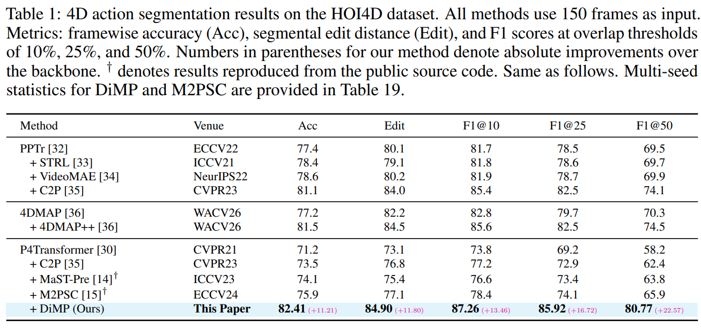

<h1 align="center">Diffusion Masked Pretraining for Dynamic Point Cloud</h1>

<p align="center"><i>DiMP (Diffusion Masked Pretraining) is a unified self-supervised framework for dynamic point clouds that uses diffusion for mask-only center prediction and DDPM-based inter-frame motion supervision.</i></p>

## Abstract

Dynamic point cloud pretraining is still dominated by masked reconstruction objectives. However, these objectives inherit two key limitations. Existing methods inject ground-truth tube centers as decoder positional embeddings, causing spatio-temporal positional leakage. Moreover, they supervise inter-frame motion with deterministic proxy targets that systematically discard distributional structure by collapsing multimodal trajectory uncertainty into conditional means. To address these limitations, we propose Diffusion Masked Pretraining (DiMP), a unified self-supervised framework for dynamic point clouds. DiMP introduces diffusion modeling into both positional inference and motion learning. It first applies forward diffusion noise only to masked tube centers, then predicts clean centers from visible spatio-temporal context. This removes positional leakage while preserving visible coordinates as clean temporal anchors. DiMP also reformulates point-wise inter-frame displacement supervision as a DDPM noise-prediction objective conditioned on decoded representations. This design drives the encoder to target the full conditional distribution of plausible motions under a variational surrogate, rather than collapsing to a single deterministic estimate. Extensive experiments demonstrate that DiMP consistently improves downstream accuracy over the backbone alone, with absolute gains of 11.21% on offline action segmentation and 13.65% under causally constrained online inference.

## Overview

<div align="center">
  
</div>

## Getting Started

The following steps describe how to set up this repository and run pretraining and finetuning.

### Requirements

- Python 3.8+ (3.8 used in `setup_env.sh`)
- PyTorch with CUDA matching your driver / `nvcc`
- GCC compatible with your CUDA toolkit (see [DEPLOYMENT.md](DEPLOYMENT.md))

### Quick Start

```bash
conda create -n dimp python=3.8 -y
conda activate dimp

# Install PyTorch for your CUDA version (example — adjust -c / wheel index as needed)
pip install torch torchvision

pip install -r requirements.txt

# PointNet++ (under modules/)
cd modules
python setup.py install
cd ..

# Chamfer distance
cd extensions/chamfer_dist
python setup.py install
cd ../..
```

For a fuller server setup (CUDA matrix, troubleshooting), see [DEPLOYMENT.md](DEPLOYMENT.md). You can also run `bash setup_env.sh` on Linux if you use the bundled script.

### Datasets

**HOI4D** — under **`DiMP/hoi4d_npz/`** (repo root): flat preprocessed NPZ only (no subfolders). Names follow  
`{ZY}_{H#}_{C##}_{N##}_{S###}_{s##}_{T#}.npz` (exact pattern matches your exports). Meta lists use the same stem without `.npz`; see [DEPLOYMENT.md](DEPLOYMENT.md) Section 3.

**MSRAction3D** — under **`DiMP/MSRAction3D/`** (repo root): `Depth/`, `MSRAction3DSkeleton(20joints)/`, **`msr_npz/`** (and optional **`smoke_npz/`**) with flat `a##_s##_e##.npz` + optional `_meta.txt`, plus root-level `a##_s##_e##_skeleton3D.txt` and `.rar` archives. **Training:** set `--data-path` to `MSRAction3D/msr_npz/` (or `smoke_npz/`), not the `MSRAction3D/` root. Naming: `a##` action, `s##` subject, `e##` execution.

<details>
<summary>click to expand — DiMP repository layout</summary>

```text
DiMP/                              # this repo
├── data_aug/
├── datasets/                      # meta .list files, code loaders
├── fig/
├── modules/
├── hoi4d_npz/                     # flat HOI4D NPZ (often gitignored)
│   ├── ZY20210800001_H1_C11_N07_S185_s02_T2.npz
│   └── …
├── MSRAction3D/                   # MSR data tree (often gitignored)
│   ├── Depth/
│   ├── MSRAction3DSkeleton(20joints)/
│   ├── msr_npz/                   # ← pass this as --data-path for msr
│   │   ├── _meta.txt
│   │   └── a##_s##_e##.npz
│   ├── smoke_npz/
│   └── …
└── ...
```

</details>

Optional shell helpers: `run_pretrain_msr.sh`, `run_finetune_msr.sh`. Full layout and meta format: [DEPLOYMENT.md](DEPLOYMENT.md).

## Main Results

<div align="center">
  
</div>

## Training and finetuning

**Appendix (paper):** pretraining uses **`--mask-ratio 0.60`**, **`--num-points 1024`** per frame, and **`--batch-size 128`** on **8× A100** (reduce if OOM). Finetuning: **2048** pts/frame for HOI4D action segmentation, MSR, and HOI4D classification; **4096** for HOI4D semantic segmentation.

### Self-supervised pretraining

> **Important:** In `0-pretraining-dp.py`, only `--model` names starting with **`Full_`** select **`DiMPModelFull`** (paper DiMP: center + motion diffusion). Any other name (including the default `pretrain`) uses **`DiMPModel`**, an older SHOT-style baseline without the full diffusion objectives. The commands below use **`Full_*`** so Quick Start matches the paper.

**HOI4D** (requires `--data-meta`):

```bash
# Paper: batch 128 on 8× A100; --mask-ratio 0.60.
python 0-pretraining-dp.py \
  --dataset hoi4d \
  --data-path /path/to/DiMP/hoi4d_npz \
  --data-meta ./datasets/your_train_meta.list \
  --log-dir ./logs \
  --num-points 1024 \
  --batch-size 32 \
  --mask-ratio 0.60 \
  --model Full_pretrain
```

**MSRAction3D** (NPZ root; optional `run_pretrain_msr.sh` for preprocessing + launch):

```bash
python 0-pretraining-dp.py \
  --dataset msr \
  --data-path /path/to/DiMP/MSRAction3D/msr_npz \
  --log-dir ./logs \
  --num-points 1024 \
  --batch-size 32 \
  --mask-ratio 0.60 \
  --radius 0.1 \
  --model Full_MSR_pretrain
```

Optional tuning: `--center-diffusion-mode`, `--radius` (e.g. **0.1** for MSR in some setups), `--use-patch-diffusion`, `--use-motion-diffusion` — see `python 0-pretraining-dp.py --help`. Checkpoints are saved under `{log_dir}/{model}/` (e.g. `./logs/Full_pretrain/checkpoint_last.pth`).

### Action recognition (classification)

**MSRAction3D** (`--dataset msr`): point `--data-path` at the NPZ root; train/val splits are handled by the loader (no meta list). **2048** pts/frame for finetuning (appendix).

```bash
python 1-finetune-dp.py \
  --dataset msr \
  --data-path /path/to/DiMP/MSRAction3D/msr_npz \
  --finetune /path/to/pretrain/checkpoint_last.pth \
  --num-points 2048 \
  --log-dir ./logs \
  --model E0_cls
```

For **HOI4D** subject classification instead, use `--dataset hoi4d` with `--data-meta` and **`--num-points 2048`** (see `1-finetune-dp.py --help`).

### HOI4D semantic segmentation

**4096** pts/frame (appendix).

```bash
python 2-finetune-sem-seg.py \
  --data-path /path/to/DiMP/hoi4d_npz \
  --meta-train ./datasets/semseg_train.list \
  --meta-val ./datasets/semseg_val.list \
  --pretrained /path/to/pretrain/checkpoint_last.pth \
  --num-points 4096 \
  --log-dir ./logs \
  --model sem_seg
```

Resume with `--resume /path/to/checkpoint.pth` (mutually exclusive with `--pretrained` in the resume path).

### HOI4D temporal action segmentation

**2048** pts/frame (appendix).

```bash
python 2-finetune-action-seg.py \
  --data-path /path/to/DiMP/hoi4d_npz \
  --meta-train ./datasets/action_train.list \
  --meta-val ./datasets/action_val.list \
  --pretrained /path/to/pretrain/checkpoint_last.pth \
  --num-points 2048 \
  --log-dir ./logs \
  --model action_seg
```
